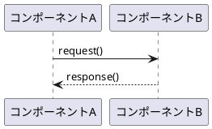
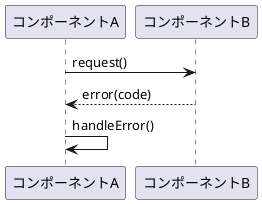
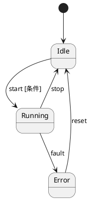

# ソフトウェアアーキテクチャ設計書 (SAD)

| 項目           | 内容                         |
|----------------|------------------------------|
| ドキュメントID | SAD_<プロジェクトID>_001     |
| バージョン     | v1.0                         |
| 日付           | YYYY-MM-DD                   |
| 作成者         |                              |
| 承認者         |                              |
| ステータス     | Draft                        |
| 関連プロセス   | SWE.2                        |

---

## 1. 目的・スコープ

本書は、<プロジェクト名>における<対象ソフトウェア名>のアーキテクチャを定義する。

---

## 2. 参照文書

| 文書ID    | タイトル                     | バージョン | 備考 |
|-----------|------------------------------|-----------|------|
|           | ソフトウェア要件仕様書 (SRS) |           |      |

---

## 3. 用語定義

| 用語 | 定義 |
|------|------|
|      |      |

---

## 4. アーキテクチャ概要

### 4.1 設計方針

<採用したアーキテクチャスタイル（レイヤード・マイクロサービス等）と選択理由>

### 4.2 全体構成図

```
┌─────────────────────────────────────────┐
│              アプリケーション層          │
├─────────────────────────────────────────┤
│              サービス層                  │
├─────────────────────────────────────────┤
│              インフラ層                  │
└─────────────────────────────────────────┘
```

---

## 5. コンポーネント構成

### ARC-001: <コンポーネント名>

| フィールド       | 内容                               |
|------------------|------------------------------------|
| **ID**           | ARC-001                            |
| **コンポーネント名** |                                |
| **責務**         | <このコンポーネントが担う機能>     |
| **担当 SWR**     | SWR-001, SWR-002                   |
| **外部依存**     |                                    |
| **制約**         |                                    |
| **提供 API**     |                                    |
| **消費 API**     |                                    |

---

### ARC-002: <コンポーネント名>

| フィールド       | 内容                               |
|------------------|------------------------------------|
| **ID**           | ARC-002                            |
| **コンポーネント名** |                                |
| **責務**         |                                    |
| **担当 SWR**     |                                    |
| **外部依存**     |                                    |
| **制約**         |                                    |
| **提供 API**     |                                    |
| **消費 API**     |                                    |

<!-- コンポーネントごとにブロックを追加 -->

---

## 6. インターフェース設計

| IFC-ID  | 提供側    | 消費側    | 操作/メッセージ名 | 引数・戻り値 | 呼び出し頻度 | エラー処理 |
|---------|-----------|-----------|-----------------|-------------|------------|-----------|
| IFC-001 | ARC-001   | ARC-002   |                 |             |            |           |

---

## 7. 動的ふるまい

### 7.1 シーケンス図（正常シナリオ）



### 7.2 シーケンス図（異常シナリオ）



### 7.3 状態遷移図



---

## 8. リソース消費目標

| コンポーネント | CPU 使用率 | メモリ (KB) | 通信帯域 (bps) | ストレージ (KB) |
|--------------|-----------|------------|--------------|--------------|
| ARC-001      | < XX%     | < XXXX     | < XXXX       | < XXXX       |
| 合計         | < XX%     | < XXXX     | -            | -            |

---

## 9. 要件割り当て

| SWR-ID  | SWR タイトル | 割り当て ARC | 備考 |
|---------|-------------|-------------|------|
| SWR-001 |             | ARC-001     |      |

---

## 10. トレーサビリティマトリクス

| SWR-ID  | SWR タイトル | ARC-ID  | コンポーネント名 | カバレッジ |
|---------|-------------|---------|-----------------|-----------|
| SWR-001 |             | ARC-001 |                 | 完全       |

---

## 11. 設計上の決定・根拠 (ADR)

### ADR-001: <決定事項タイトル>

**ステータス**: Accepted

**コンテキスト**: <この決定が必要になった背景>

**決定内容**: <採用したアプローチ>

**採用理由**: <根拠>

**却下した代替案**:
- 案A: <説明> — 却下理由: <理由>

**影響**: <トレードオフ・制約>

---

## 変更履歴

| バージョン | 日付       | 変更概要     | 作成/変更者 | レビュー者 |
|-----------|------------|--------------|------------|-----------|
| 1.0       | YYYY-MM-DD | 初版作成     |            |           |
