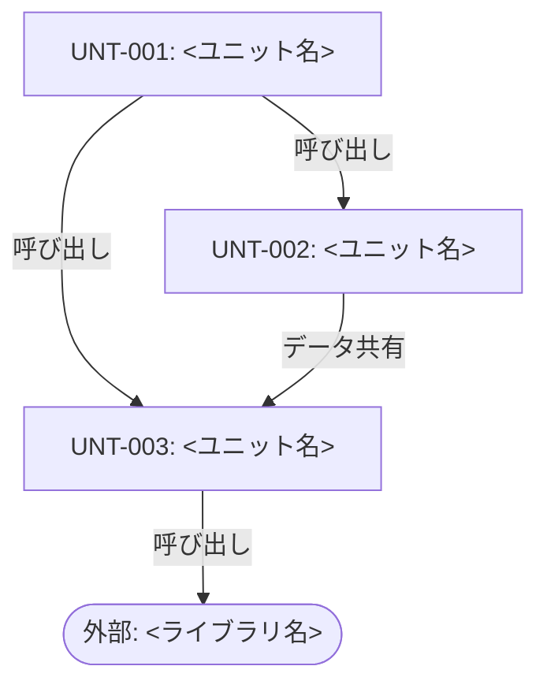
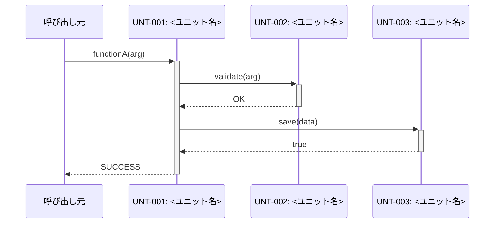
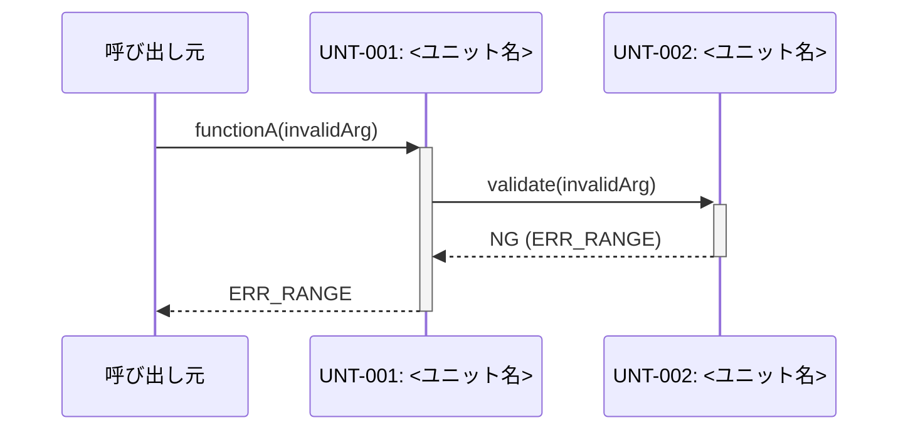
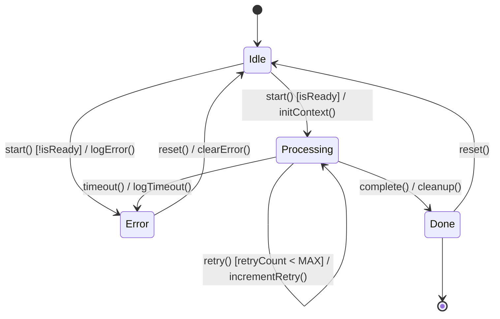
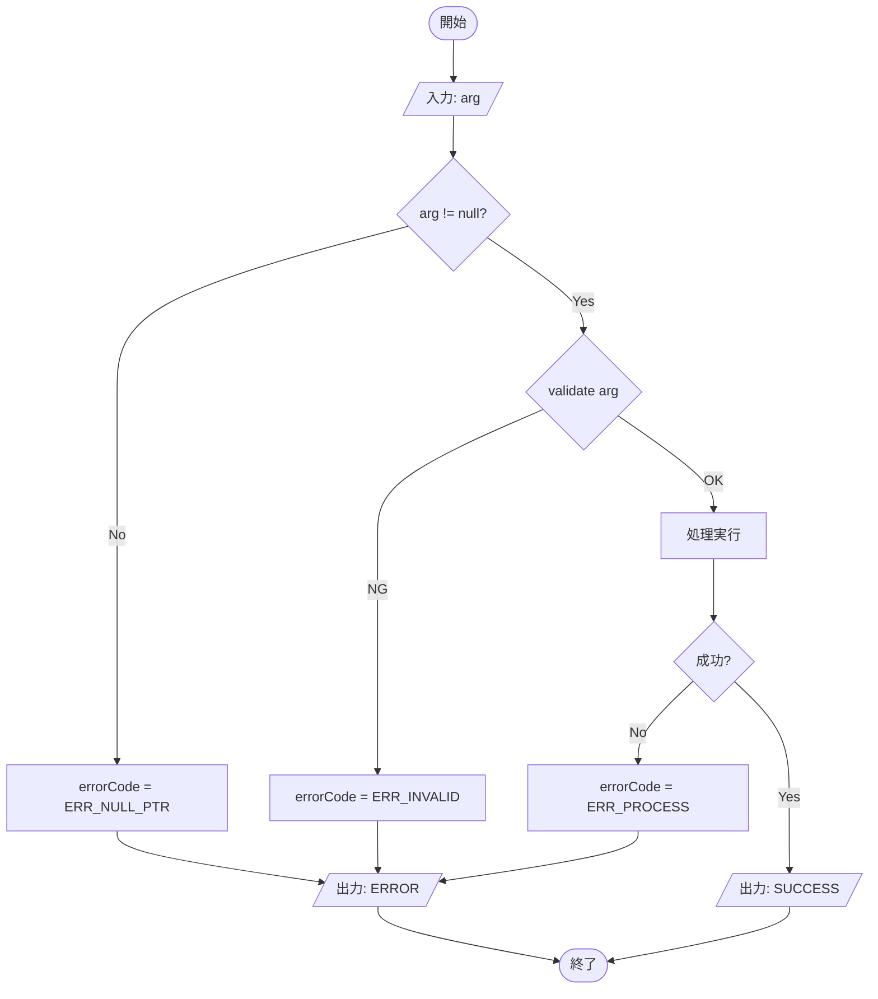

# ソフトウェア詳細設計書 (SDD)

| 項目           | 内容                         |
|----------------|------------------------------|
| ドキュメントID | SDD_<プロジェクトID>_001     |
| バージョン     | v1.0                         |
| 日付           | YYYY-MM-DD                   |
| 作成者         |                              |
| 承認者         |                              |
| ステータス     | Draft                        |
| 関連プロセス   | SWE.3                        |

---

## 1. 目的・スコープ

本書は、<プロジェクト名>における <対象コンポーネント名> (ARC-xxx) の詳細設計を定義する。  
対象ユニット: UNT-001〜UNT-00N

---

## 2. 参照文書

| 文書ID    | タイトル                         | バージョン | 備考 |
|-----------|----------------------------------|-----------|------|
|           | ソフトウェアアーキテクチャ設計書 |           |      |
|           | インターフェース設計書           |           |      |
|           | コーディング規約                 |           |      |

---

## 3. 用語定義

| 用語 | 定義 |
|------|------|
|      |      |

---

## 4. ユニット構成

### 4.1 ユニット一覧

| UNT-ID  | ユニット名 | 親 ARC  | ファイルパス  | 担当 SWR      |
|---------|-----------|---------|--------------|---------------|
| UNT-001 |           | ARC-001 | src/xxx.js   | SWR-001, 002  |
| UNT-002 |           | ARC-001 | src/yyy.js   | SWR-003       |

### 4.2 モジュール構造図

ユニット間の依存関係と外部依存を示す。矢印は「依存する方向」（呼び出し元 → 呼び出し先）。



> 凡例: 実線矢印 = 関数呼び出し / 点線矢印 = イベント通知 / 角丸ノード = 外部依存

### 4.3 ファイル構成

```
src/
├── <module>/
│   ├── UNT-001_<name>.js   # <責務の一言説明>
│   ├── UNT-002_<name>.js   # <責務の一言説明>
│   └── UNT-003_<name>.js   # <責務の一言説明>
└── index.js
```

---

## 5. クラス / データ構造設計

> **OOP 言語（C++/Java/Python 等）の場合はクラス図を、C 言語の場合はデータ構造図（struct/enum）を記載する。**

### 5.1 クラス図（OOP 言語の場合）

クラス名・属性（型付き）・メソッド（引数・戻り値型付き）・クラス間の関係を示す。

```mermaid
classDiagram
    class <ClassName> {
        -String privateField
        +int publicField
        +methodName(arg: ArgType) ReturnType
        -privateMethod() void
    }
    class <InterfaceName> {
        <<interface>>
        +requiredMethod(arg: ArgType) ReturnType
    }
    class <EnumName> {
        <<enumeration>>
        VALUE_A
        VALUE_B
        VALUE_C
    }

    %% 関係の記法:
    %% <|--  継承 (is-a)
    %% *--   コンポジション (ライフサイクル共有)
    %% o--   集約 (ライフサイクル独立)
    %% -->   依存 (一時的な使用)
    %% ..|>  実現 (インターフェース実装)

    <InterfaceName> <|.. <ClassName> : implements
    <ClassName> *-- <EnumName> : has
```

### 5.2 データ構造図（C 言語の場合）

struct / enum / typedef の定義と参照関係を示す。

```mermaid
classDiagram
    class <StructName>_t {
        <<struct>>
        +uint32_t fieldA
        +uint8_t  fieldB
        +<EnumName>_e status
        +uint8_t  data[MAX_SIZE]
    }
    class <EnumName>_e {
        <<enum>>
        STATE_IDLE
        STATE_RUNNING
        STATE_ERROR
    }
    class <ContainerStruct>_t {
        <<struct>>
        +<StructName>_t items[MAX_ITEMS]
        +uint8_t count
    }

    <StructName>_t --> <EnumName>_e : uses
    <ContainerStruct>_t *-- <StructName>_t : contains
```

---

## 6. ユニット詳細

### UNT-001: <ユニット名>

| フィールド           | 内容                               |
|----------------------|------------------------------------|
| **ID**               | UNT-001                            |
| **ユニット名**       |                                    |
| **親コンポーネント** | ARC-001                            |
| **責務**             | <担う処理を3行以内>                |
| **ファイルパス**     | src/<name>.js                      |
| **担当 SWR**         | SWR-001, SWR-002                   |

#### アルゴリズム

複雑な処理ロジックを擬似コードで示す（循環的複雑度 ≤ 5 の場合は省略可）。

```
1. 入力値の検証
   1.1. null チェック → NG なら ERR_NULL_PTR を返す
   1.2. 範囲チェック → NG なら ERR_OUT_OF_RANGE を返す
2. 状態に応じた処理分岐
   2.1. 状態 = IDLE: 処理を開始し RUNNING に遷移
   2.2. 状態 = RUNNING: ERR_BUSY を返す
3. 結果を出力して SUCCESS を返す
```

---

### UNT-002: <ユニット名>

（UNT-001 と同じ構成で追加）

---

## 7. インターフェース仕様

### 7.1 <関数名 / メソッド名>

| フィールド | 内容                                        |
|-----------|---------------------------------------------|
| 宣言      | `ReturnType functionName(ArgType arg1)`     |
| 目的      | <何をする関数か1行で>                       |
| 引数      | `arg1`: ArgType, 範囲/制約, <説明>          |
| 戻り値    | SUCCESS(0) / ERR_xxx(<値>): <エラー内容>   |
| 前提条件  | <この関数を呼ぶ前に満たすべき条件>          |
| 副作用    | <グローバル変数・内部状態への影響>          |
| エラー    | ERR_NULL_PTR: 引数が null / ERR_xxx: <説明> |

---

## 8. 動的ふるまい

### 8.1 シーケンス図

#### 8.1.1 正常系: <シナリオ名>

ユニット間の時系列メッセージフロー（正常ケース）。



#### 8.1.2 異常系: <エラーシナリオ名>

エラー・タイムアウト等の異常フロー。



> 異常系が複数ある場合は 8.1.3, 8.1.4 ... として追加する。

---

### 8.2 状態遷移図

> 状態を持たないユニットのみで構成される場合は「対象なし」と記載する。

状態機械の全状態・遷移条件・アクションを示す。  
遷移ラベル形式: `イベント() [ガード条件] / アクション()`



**状態一覧**

| 状態 ID | 状態名     | 説明                         |
|---------|-----------|------------------------------|
| S-001   | Idle       | 待機中。リクエスト受付可能    |
| S-002   | Processing | 処理実行中                   |
| S-003   | Done       | 処理完了                     |
| S-004   | Error      | エラー発生中                 |

---

### 8.3 フローチャート

> 循環的複雑度 ≤ 5 の関数は省略可。省略する場合は「省略理由: 単純な直線処理」等を記載する。

#### 8.3.1 <関数名>



---

## 9. エラー処理設計

| エラー種別     | エラーコード      | 検出方法           | 回復処理             | 上位への通知         |
|---------------|-------------------|--------------------|----------------------|----------------------|
| null 引数      | ERR_NULL_PTR      | null チェック       | 処理中断             | エラーコード返却      |
| 範囲外入力     | ERR_OUT_OF_RANGE  | 範囲チェック        | デフォルト値使用     | エラーコード返却      |
| タイムアウト   | ERR_TIMEOUT       | タイマー監視        | リトライ（最大3回）  | エラーコード返却      |
| 保存失敗       | ERR_STORE         | 戻り値チェック      | ロールバック         | エラーコード返却      |

---

## 10. トレーサビリティマトリクス

| ARC-ID  | コンポーネント名 | UNT-ID  | ユニット名 | ファイルパス |
|---------|----------------|---------|-----------|-------------|
| ARC-001 |                | UNT-001 |           | src/        |
| ARC-001 |                | UNT-002 |           | src/        |

---

## 変更履歴

| バージョン | 日付       | 変更概要     | 作成/変更者 | レビュー者 |
|-----------|------------|--------------|------------|-----------|
| 1.0       | YYYY-MM-DD | 初版作成     |            |           |
