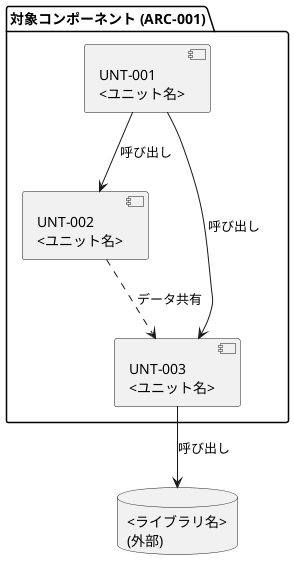
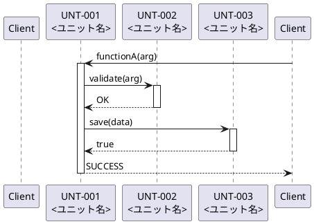
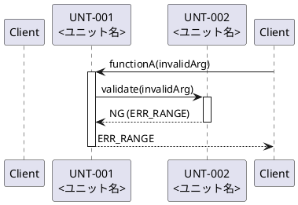
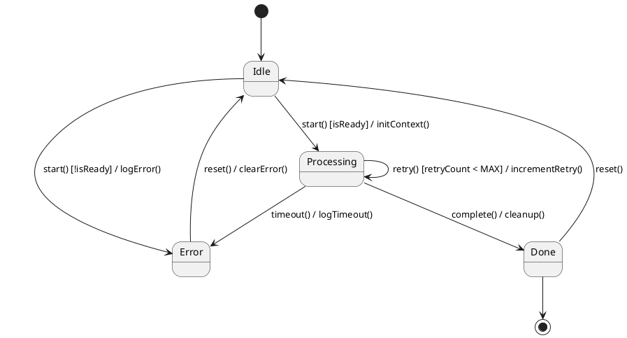
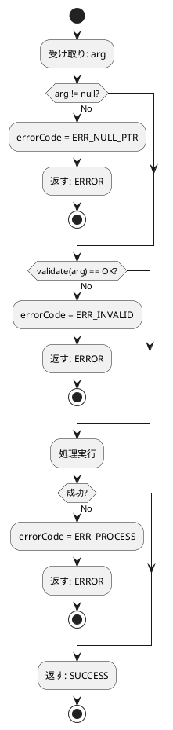

# ソフトウェア詳細設計書 (SDD)

| 項目           | 内容                         |
|----------------|------------------------------|
| ドキュメントID | SDD_<プロジェクトID>_001     |
| バージョン     | v1.0                         |
| 日付           | YYYY-MM-DD                   |
| 作成者         |                              |
| 承認者         |                              |
| ステータス     | Draft                        |
| 関連プロセス   | SWE.3                        |

### 粒度ポリシー宣言

> **SDD 作成開始前に決定し、レビュー開始前に承認を得ること。**  
> 選択肢: L1（概念）/ L2（仕様）/ L3（実装）— 詳細はルール.md 4.1.2 参照

| 図の種類     | 採用粒度 | 理由・備考 |
|-------------|---------|------------|
| クラス図     |         |            |
| シーケンス図 |         |            |

---

## 1. 目的・スコープ

本書は、<プロジェクト名>における <対象コンポーネント名> (ARC-xxx) の詳細設計を定義する。  
対象ユニット: UNT-001〜UNT-00N

---

## 2. 参照文書

| 文書ID | タイトル                         | バージョン | 備考 |
|--------|----------------------------------|-----------|------|
|        | ソフトウェアアーキテクチャ設計書 |           |      |
|        | インターフェース設計書           |           |      |
|        | コーディング規約                 |           |      |

---

## 3. 用語定義

| 用語 | 定義 |
|------|------|
|      |      |

---

## 4. ユニット構成

### 4.1 ユニット一覧

| UNT-ID  | ユニット名 | 親 ARC  | ファイルパス | 担当 SWR     |
|---------|-----------|---------|------------|--------------|
| UNT-001 |           | ARC-001 | src/       | SWR-001, 002 |
| UNT-002 |           | ARC-001 | src/       | SWR-003      |

### 4.2 モジュール構造図

ユニット間の依存関係と外部依存を示す。矢印は「依存する方向」（呼び出し元 → 呼び出し先）。



> 凡例: 実線矢印 = 関数呼び出し / 点線矢印 = データ共有/イベント / database 記号 = 外部依存

### 4.3 ファイル構成

```
src/
├── <module>/
│   ├── <name>.js    # UNT-001: <責務の一言説明>
│   ├── <name>.js    # UNT-002: <責務の一言説明>
│   └── <name>.js    # UNT-003: <責務の一言説明>
```

---

## 5. クラス / データ構造設計

> **採用粒度に従って記載すること（粒度ポリシー宣言を参照）。**  
> 対象なしの場合: 「対象なし — 理由: <クラス/struct を持たないため等>」と記載する。

### 5.1 クラス図（OOP 言語の場合）

<!-- 粒度 L2 の例: public メンバーのみ -->
```plantuml
@startuml
class <ClassName> {
    + publicField : Type
    + methodName(arg : ArgType) : ReturnType
}
interface <InterfaceName> {
    + requiredMethod(arg : ArgType) : ReturnType
}
enum <EnumName> {
    VALUE_A
    VALUE_B
    VALUE_C
}

' 関係の記法:
' <|--   継承 (is-a)
' *--    コンポジション (ライフサイクル共有)
' o--    集約 (ライフサイクル独立)
' -->    依存 (一時的な使用)
' ..|>   実現 (インターフェース実装)

<InterfaceName> <|.. <ClassName>  : implements
<ClassName>     *--  <EnumName>   : has
@enduml
```

<!-- 粒度 L3 の場合は private メンバーとコンストラクタを追加 -->

### 5.2 データ構造図（C 言語の場合）

```plantuml
@startuml
class <StructName>_t << (S,#ADD8E6) struct >> {
    + fieldA : uint32_t
    + fieldB : uint8_t
    + status : <EnumName>_e
}
class <EnumName>_e << (E,#FFD700) enum >> {
    STATE_IDLE
    STATE_RUNNING
    STATE_ERROR
}
class <ContainerStruct>_t << (S,#ADD8E6) struct >> {
    + items : <StructName>_t[MAX_SIZE]
    + count : uint8_t
}

<StructName>_t      --> <EnumName>_e         : uses
<ContainerStruct>_t *-- <StructName>_t       : contains
@enduml
```

---

## 6. ユニット詳細

### UNT-001: <ユニット名>

| フィールド           | 内容                      |
|----------------------|---------------------------|
| **ID**               | UNT-001                   |
| **ユニット名**       |                           |
| **親コンポーネント** | ARC-001                   |
| **責務**             | <担う処理を3行以内>       |
| **ファイルパス**     | src/                      |
| **担当 SWR**         | SWR-001, SWR-002          |

#### アルゴリズム

循環的複雑度 > 5 の処理のみ記載。≤ 5 の場合は「省略 — 単純な直線処理のため」と記載する。

```
1. 入力値の検証
   1.1. null チェック → NG なら ERR_NULL_PTR を返す
   1.2. 範囲チェック → NG なら ERR_OUT_OF_RANGE を返す
2. 処理実行
3. 結果を返す
```

---

### UNT-002: <ユニット名>

（UNT-001 と同じ構成で追加）

---

## 7. インターフェース仕様

### 7.1 <関数名 / メソッド名>

| フィールド | 内容                                       |
|-----------|--------------------------------------------|
| 宣言      | `ReturnType functionName(ArgType arg1)`    |
| 目的      | <何をする関数か1行で>                      |
| 引数      | `arg1`: ArgType, 範囲/制約, <説明>         |
| 戻り値    | SUCCESS(0) / ERR_xxx(<値>): <エラー内容>  |
| 前提条件  | <この関数を呼ぶ前に満たすべき条件>         |
| 副作用    | <内部状態・グローバル変数への影響>         |
| エラー    | ERR_NULL_PTR: 引数 null / ERR_xxx: <説明> |

---

## 8. 動的ふるまい

### 8.1 シーケンス図

> **採用粒度に従って記載すること。**  
> 粒度 L3 の場合は型付きシグネチャと private 呼び出しを含める（ルール.md 4.1.6 参照）。

#### 8.1.1 正常系: <シナリオ名>



#### 8.1.2 異常系: <エラーシナリオ名>



> 異常系が複数ある場合は 8.1.3, 8.1.4 ... として追加する。

---

### 8.2 状態遷移図

> 状態を持たないユニットのみの場合: 「対象なし — 理由: ステートレスな処理のため」と記載する。



**状態一覧**

| 状態 ID | 状態名     | 説明                       |
|---------|-----------|----------------------------|
| S-001   | Idle       | 待機中。リクエスト受付可能  |
| S-002   | Processing | 処理実行中                 |
| S-003   | Done       | 処理完了                   |
| S-004   | Error      | エラー発生中               |

---

### 8.3 フローチャート

> 循環的複雑度 ≤ 5 の関数は省略可。省略する場合は「省略 — 理由: <単純な直線処理等>」と記載する。

#### 8.3.1 <関数名>



---

## 9. エラー処理設計

| エラー種別   | エラーコード     | 検出方法         | 回復処理             | 上位への通知    |
|-------------|-----------------|-----------------|----------------------|----------------|
| null 引数   | ERR_NULL_PTR    | null チェック    | 処理中断             | エラーコード返却 |
| 範囲外入力  | ERR_OUT_OF_RANGE | 範囲チェック    | デフォルト値使用     | エラーコード返却 |
| タイムアウト | ERR_TIMEOUT    | タイマー監視     | リトライ（最大3回）  | エラーコード返却 |
| 保存失敗    | ERR_STORE       | 戻り値チェック   | ロールバック         | エラーコード返却 |

---

## 10. トレーサビリティマトリクス

| ARC-ID  | コンポーネント名 | UNT-ID  | ユニット名 | ファイルパス |
|---------|----------------|---------|-----------|-------------|
| ARC-001 |                | UNT-001 |           | src/        |
| ARC-001 |                | UNT-002 |           | src/        |

---

## 変更履歴

| バージョン | 日付       | 変更概要 | 作成/変更者 | レビュー者 |
|-----------|------------|---------|------------|-----------|
| 1.0       | YYYY-MM-DD | 初版作成 |            |           |
