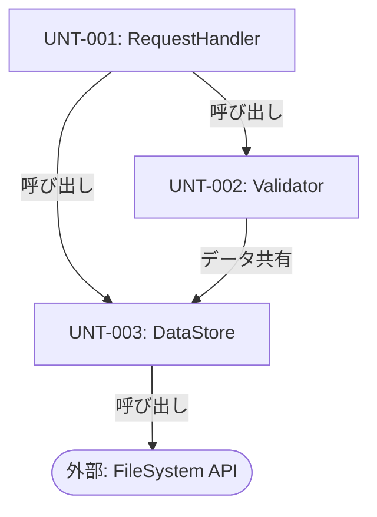
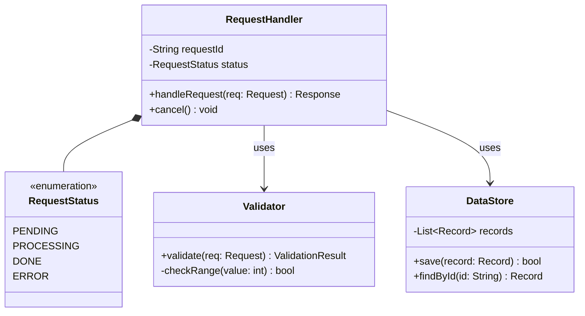
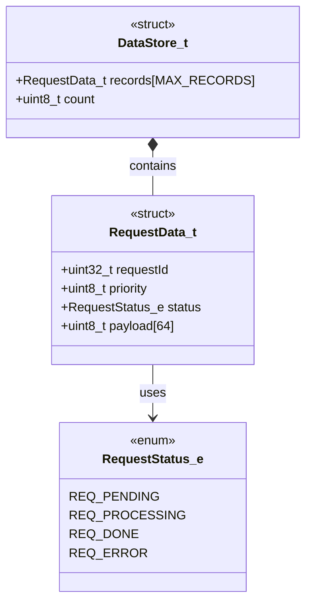
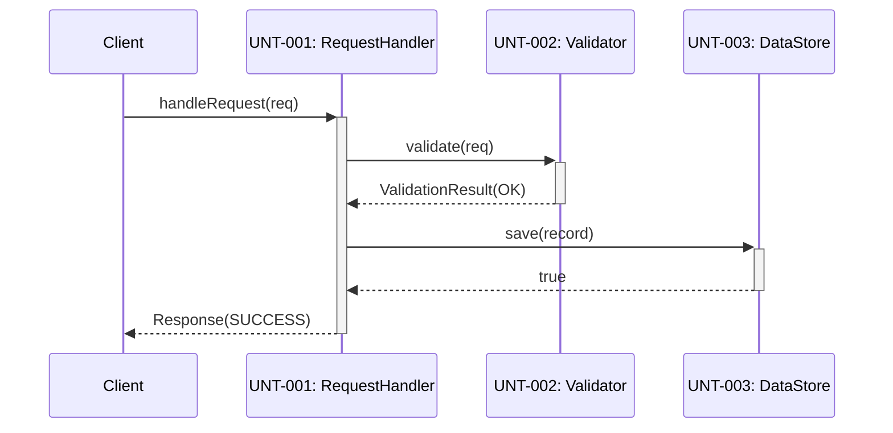
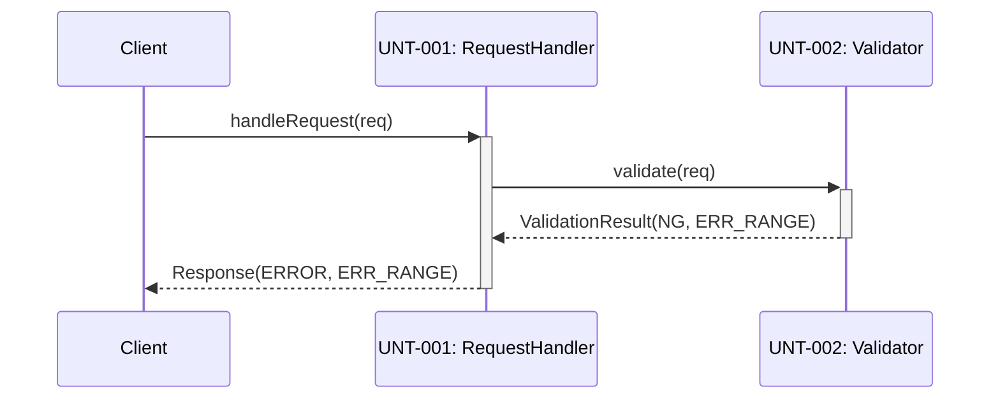
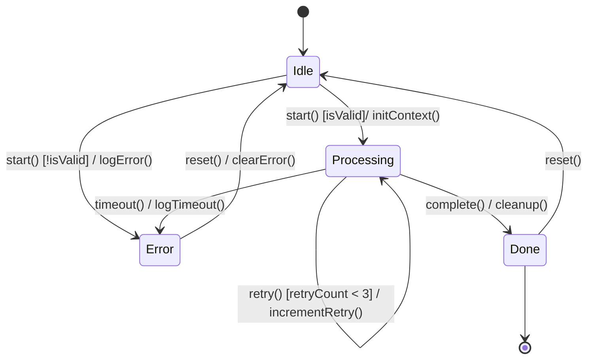
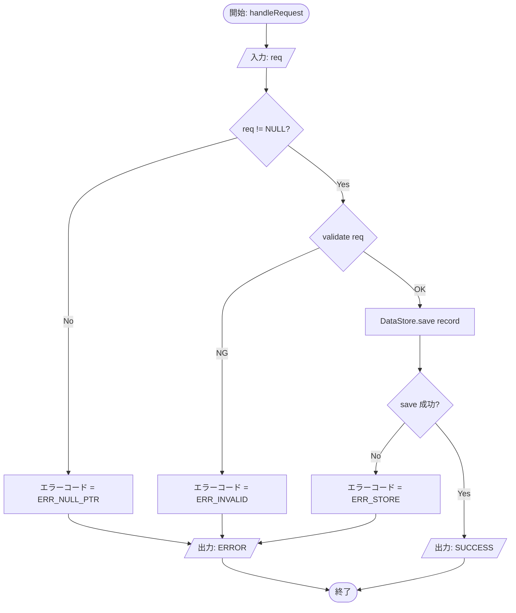

# SWE.3 ソフトウェア詳細設計・ユニット構築 — ドキュメントルール

## 1. プロセス概要

### 目的

SAD で定義されたコンポーネントを**ユニット（最小実装単位）に詳細化**し、  
実装可能な詳細設計を確立する。その設計に基づきソースコードを実装する。

### 位置づけ（入出力）

```
入力:
  - ソフトウェアアーキテクチャ設計書 (SAD)
  - インターフェース設計書

出力:
  - ソフトウェア詳細設計書 (SDD)
  - ソースコード（ユニット）
  - コーディング規約

後続:
  - SWE.4（SDD・ソースコードを入力としてユニット検証へ）
```

---

## 2. ベースプラクティス

| BP  | 内容                                           | 対応する成果物・記述箇所            |
|-----|------------------------------------------------|-------------------------------------|
| BP1 | ソフトウェア詳細設計の開発                     | SDD ユニット設計章                  |
| BP2 | ソフトウェアユニットのインターフェース定義      | SDD インターフェース仕様章          |
| BP3 | 動的ふるまいの記述                             | SDD フロー図・状態遷移図            |
| BP4 | ソフトウェア詳細設計の評価                     | レビュー記録                        |
| BP5 | ソフトウェアユニットの実装                     | ソースコード、コーディング規約       |
| BP6 | 双方向トレーサビリティの確立                   | トレーサビリティマトリクス          |

---

## 3. 必須ドキュメント一覧

| ドキュメント名           | 略称  | 目的                                           |
|--------------------------|-------|------------------------------------------------|
| ソフトウェア詳細設計書   | SDD   | ユニットの詳細設計（アルゴリズム・データ構造等）を定義する |
| コーディング規約         | COD   | ソースコードの記述ルール・禁止事項を定義する   |
| トレーサビリティマトリクス | TM  | ARC → UNT のマッピングを記録する              |

---

## 4. ドキュメント記述ルール

### 4.1 ソフトウェア詳細設計書 (SDD)

#### 4.1.1 必須構成

| 章番号 | 章タイトル           | 必須記載内容                                         |
|--------|----------------------|------------------------------------------------------|
| 1      | 目的・スコープ       | 本 SDD の適用対象ユニット・設計方針                  |
| 2      | 参照文書             | SAD・コーディング規約のリスト                        |
| 3      | 用語定義             | 本書固有の用語・略語                                 |
| 4      | ユニット構成         | ユニット一覧・モジュール構造図・ファイル構成          |
| 5      | クラス / データ構造設計 | クラス図・データ構造図・型定義                     |
| 6      | ユニット詳細         | 各ユニットの責務・アルゴリズム・API仕様              |
| 7      | インターフェース仕様 | ユニット公開 API の詳細仕様                         |
| 8      | 動的ふるまい         | シーケンス図・状態遷移図・フローチャート             |
| 9      | エラー処理設計       | エラー種別・検出方法・回復処理                       |
| 10     | トレーサビリティ     | ARC → UNT のマトリクス                              |
| 付録   | 変更履歴             | バージョン管理テーブル                               |

#### 4.1.2 図の記法・必須/推奨区分

すべての図は **Mermaid 記法** (```` ```mermaid ```` ブロック) で記述する。  
Mermaid はテキストベースのため Git 管理・差分確認が可能であり、GitHub で直接レンダリングされる。

| 図の種類             | 必須 / 推奨   | 適用条件                                   | Mermaid 図種       |
|----------------------|---------------|--------------------------------------------|---------------------|
| モジュール構造図     | **必須**      | 常に（ユニット間依存関係の全体把握）        | `graph TD`          |
| クラス図             | **必須**      | OOP 言語 (C++/Java/Python 等) を使う場合  | `classDiagram`      |
| データ構造図         | **必須**      | C 言語等で struct/typedef を使う場合       | `classDiagram`      |
| シーケンス図（正常系）| **必須**     | ユニット間メッセージが発生するすべての機能  | `sequenceDiagram`   |
| シーケンス図（異常系）| **必須**     | エラー・タイムアウト等の異常フロー          | `sequenceDiagram`   |
| 状態遷移図           | **必須**      | 状態を持つユニット（状態機械がある場合）    | `stateDiagram-v2`   |
| フローチャート       | **必須**      | 循環的複雑度 > 5 の関数・処理ロジック      | `flowchart TD`      |
| アクティビティ図     | 推奨          | 並行処理・フォーク/ジョインがある処理       | `flowchart TD`      |
| ER 図                | 推奨          | DB・永続化データ構造がある場合              | `erDiagram`         |

> **「必須」の判断基準**: 適用条件に合致するユニットが SDD 内に 1 つでも存在すれば、  
> その図を SDD に含めなければならない。該当ユニットが存在しない場合は「対象なし」と明記する。

#### 4.1.3 モジュール構造図の記述ルール

- SDD 内のすべての UNT を頂点とし、依存方向を矢印で示す
- 依存の種類（呼び出し / データ共有 / イベント通知）をラベルで区別する
- 外部ライブラリ・OS サービスへの依存も含める（外部ノードは角丸で区別）



#### 4.1.4 クラス図 / データ構造図の記述ルール

**OOP 言語（クラス図）の場合:**

- クラス名・属性（型付き）・メソッド（引数・戻り値型付き）を必ず記載する
- 関係の種類を使い分ける:

| 記号      | 意味       | 使いどころ                              |
|-----------|------------|-----------------------------------------|
| `<\|--`  | 継承       | is-a 関係                               |
| `*--`     | コンポジション | ライフサイクルを共にする強い包含関係  |
| `o--`     | 集約       | ライフサイクルが独立した包含関係        |
| `-->`     | 依存       | 一時的な使用関係（引数・戻り値で使用）  |
| `..>`     | 実現       | インターフェース実装                    |



**C 言語（データ構造図）の場合:**

- `<<struct>>` / `<<enum>>` / `<<typedef>>` ステレオタイプを使用する
- ポインタによる参照は依存矢印で表現する



#### 4.1.5 シーケンス図の記述ルール

- 正常系と異常系を**別々のシーケンス図**として作成する
- 参加者（participant）は UNT-ID または外部システム名を記載する
- `activate` / `deactivate` で実行期間を示す
- `alt` / `opt` / `loop` ブロックで条件分岐・繰り返しを表現する
- タイミング制約がある場合はメッセージラベルに `[<時間制約>]` を付記する





#### 4.1.6 状態遷移図の記述ルール

- すべての状態を網羅する（到達不能な状態も含め、その旨を注記する）
- 遷移ラベルは `イベント [ガード条件] / アクション` 形式で記述する
- 初期状態・終了状態を必ず明示する
- 状態が 5 つ以上の場合は複合状態（サブ状態機械）への分割を検討する



#### 4.1.7 フローチャートの記述ルール

- 関数単位で作成する（1 関数 = 1 フローチャート）
- すべての分岐に条件ラベル（Yes/No または条件式）を付ける
- 入力・出力を菱形ではなく平行四辺形ノード (`[/input/]`) で表現する
- ループの終了条件を必ず示す
- 循環的複雑度 ≤ 5 の単純な関数はフローチャートを省略できる（省略理由を記載）



#### 4.1.8 ユニット記述ルール

各ユニットは以下のフィールドを持つ。

| フィールド       | ルール                                                       |
|------------------|--------------------------------------------------------------|
| ID               | `UNT-<3桁連番>` 形式（例: UNT-001）                         |
| ユニット名       | コンポーネント名＋役割を示す名称                             |
| 親コンポーネント | 対応する ARC-xxx を記載                                      |
| 責務             | このユニットが担う処理を3行以内で記述                        |
| ファイルパス     | ソースコードの相対パスを記載                                 |
| 担当 SWR         | 実現する SWR-xxx をカンマ区切りで列挙                        |
| 公開 API         | 外部に公開する関数・メソッドの名称一覧                       |
| データ構造       | ユニットが使用する主要な構造体・クラスの概要                 |
| アルゴリズム     | 複雑な処理は擬似コードまたはフローチャートで記述             |

#### 4.1.3 API 仕様の記述ルール

```markdown
#### <関数名>

| フィールド | 内容                                 |
|-----------|--------------------------------------|
| 宣言      | `<戻り値型> <関数名>(<引数リスト>)`  |
| 目的      | <何をする関数か1行で>               |
| 引数      | <引数名>: <型>, <範囲/制約>, <説明> |
| 戻り値    | <型>, <値の意味>, <エラー時の値>    |
| 前提条件  | <この関数を呼ぶ前に満たすべき条件>  |
| 副作用    | <グローバル変数・状態への影響>      |
| エラー    | <エラーケースと戻り値・例外>        |
```

### 4.2 コーディング規約

#### 4.2.1 必須構成

| 章番号 | 内容                               |
|--------|------------------------------------|
| 1      | 対象言語・バージョン               |
| 2      | ファイル構成・命名規則             |
| 3      | コーディングスタイル（インデント・括弧等） |
| 4      | 命名規則（変数・関数・クラス等）   |
| 5      | コメント規則                       |
| 6      | 禁止事項                           |
| 7      | セキュリティ考慮事項               |
| 8      | 静的解析ツール設定                 |

#### 4.2.2 禁止事項の記述形式

```markdown
| 禁止項目 | 禁止理由           | 代替手段           |
|---------|--------------------|--------------------|
| goto 文 | 制御フローが不明瞭 | ループ・関数呼び出し |
```

---

## 5. トレーサビリティ要件

### 上位トレーサビリティ (ARC → UNT)

- すべての UNT は対応する ARC を持つこと
- ARC は自身が実現する UNT 一覧を SDD に記録すること

### 下位トレーサビリティ (UNT → SWE.4)

- SWE.4 完了後、各 UNT に対応するテストケース (TC-UNT-xxx) を SDD に追記する

### コードのトレーサビリティ

- ソースコードの各関数/モジュールに SWR-ID または UNT-ID をコメントで記載することを推奨する

### トレーサビリティマトリクス形式

| ARC-ID  | コンポーネント名 | UNT-ID  | ユニット名         | ファイルパス |
|---------|----------------|---------|--------------------|-------------|
| ARC-001 | ProcessManager | UNT-001 | ProcessController  | src/proc.c  |

---

## 6. レビュー・承認基準

### レビューチェックリスト

**構造設計**
- [ ] すべての ARC が少なくとも1つの UNT に分解されている
- [ ] すべての UNT に一意の ID が付与されている
- [ ] モジュール構造図が存在し、すべての UNT と外部依存が記載されている
- [ ] クラス図（OOP）またはデータ構造図（C）に全クラス/struct が記載されている
- [ ] クラス図の関係（継承・コンポジション・依存）が適切に区別されている

**インターフェース・API**
- [ ] すべての公開 API に引数・戻り値・エラーが記述されている

**動的ふるまい**
- [ ] ユニット間相互作用に対してシーケンス図（正常系）が存在する
- [ ] ユニット間相互作用に対してシーケンス図（異常系）が存在する
- [ ] 状態を持つユニットに状態遷移図が存在し、すべての状態・遷移が網羅されている
- [ ] 循環的複雑度 > 5 の関数にフローチャートが存在する
- [ ] すべての分岐・ループに条件が明示されている

**エラー処理**
- [ ] エラー処理の設計が全ユニットに記述されている

**実装・規約**
- [ ] コーディング規約が承認済みである
- [ ] ソースコードがコーディング規約に準拠している（静的解析通過）

**トレーサビリティ**
- [ ] トレーサビリティマトリクスに欠落がない

### 承認条件

1. 上記チェックリストの全項目が ✓ であること
2. 重大レビュー指摘がゼロであること
3. 工程責任者の署名（または承認記録）があること

---

## 7. 成果物管理ルール

| 項目           | ルール                                              |
|----------------|-----------------------------------------------------|
| SDD ファイル命名 | `SDD_<プロジェクトID>_<連番>_v<X.Y>.md`          |
| 格納場所       | `docs/SWE3/` 配下                                  |
| ソースコード   | Git で管理、コミットメッセージに UNT-ID を含める    |
| 静的解析結果   | 各バージョンの解析ログを `docs/SWE3/analysis/` に保存 |

---

## 改訂履歴

| バージョン | 日付       | 変更概要     | 作成/変更者 | レビュー者 |
|-----------|------------|--------------|------------|-----------|
| 1.0       | 2026-06-12 | 初版作成     | -          | -         |
